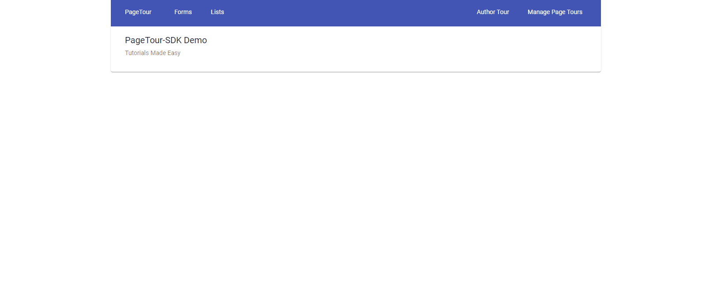
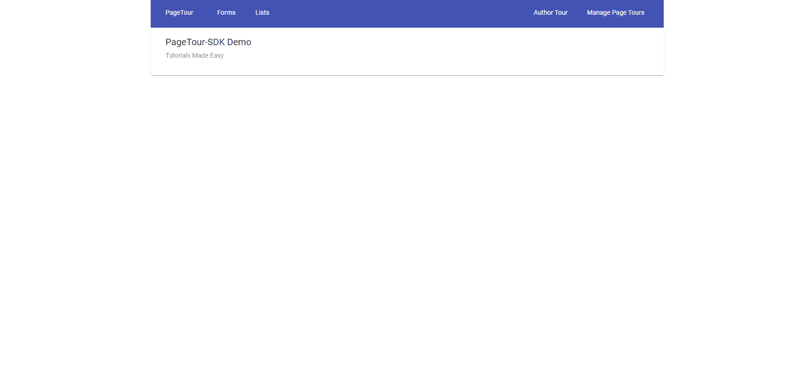
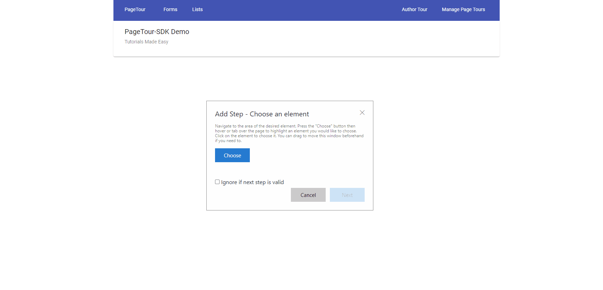
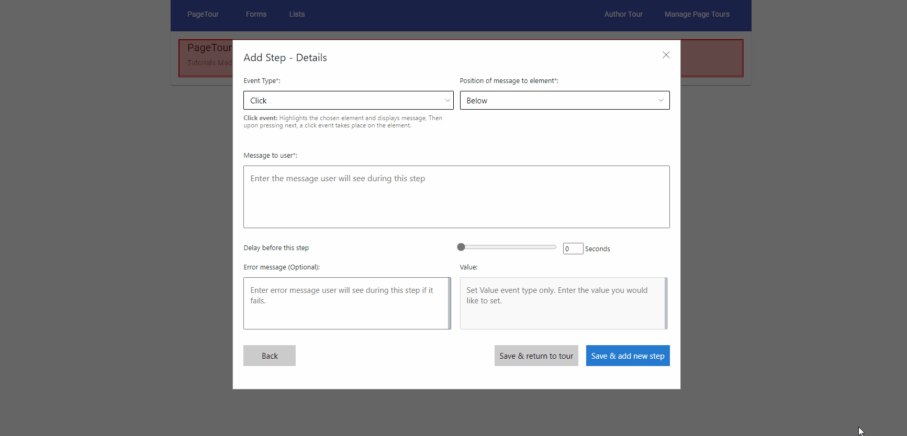
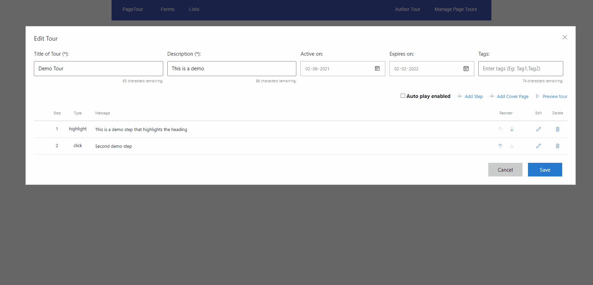
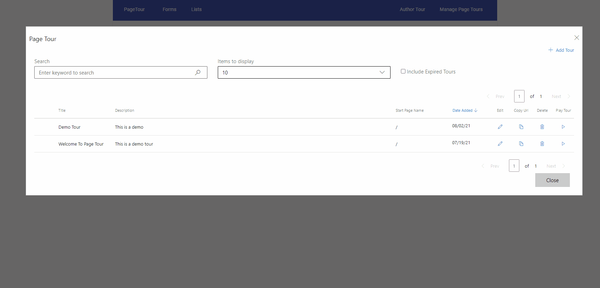

 # PageTour SDK

  

  

## Overview

  

User readiness, digital app adoption, and app feature visibility in enterprise and consumer products is efficacious when driven interactively, and within the context of the application. However, the cost and delay in engineering such assets significantly impacts fast adoption, smooth engagement, and overall user satisfaction for your application. PageTour SDK addresses this ubiquitous challenge through interactive page tours, System Annoucement and Smart Tips.  It also supports Voice-to-Text transcript generation to add transcripts on-the-go for audio voiceovers.
 
PageTour is a lightweight, Typescript SDK distributed as an NPM package. The SDK can be consumed in Angular, React, Typescript, and Plain JavaScript web apps. It provides an intuitive UI to web developers and application admins to author guided tours for web apps. Tours can be shared with end users through generated URLs, and also be targeted to a defined set of users.
 
PageTour SDK is easy to use and provides a number of options to customize your product for feature readiness, release announcement and landing efforts.

To address the user needs below tours can be created using Page tour

### Page tour and Interactive Guides
Page Tour has been split into two separate features, enhanced with stability fixes, and improved component selectors
• Page Tours blur out rest of the page, except for highlighted component
• Allows users to stay focused on the tour step
• Reduces tour failures due to users interacting with page when a tour is running 
• Interactive Guides allows users to interact with page as a tour is running to allow short immersive in-system training (existing feature)

### System Announcements
System Announcements allow you to notify users about new major releases, such as a feature, workflows change etc., with a hero content for each page. Key features:
•	Author multiple pages in a single announcement 
•	Customizable hero content on top with support for image, gif, video
•	Customizable page titles, with rich editing options in body text
•	Live preview in authoring experience

### Smart Tips
Smart Tips enable authors to highlight a component in a page to draw user’s attention. It acts as a focal point to provide additional details on hover, without leaving the page context. Key features:
•	Non-intrusive design
•	Options to permanently or temporarily dismiss Tips
•	Author multiple tips in a single bundle with common start/end dates 

## Installation

### PageTour SDK
  

    npm install pagetour-sdk

  

### Repository package

PageTour SDK requires a repository object for initialization. One can either use one of the two available repository packages, or write a new custom repository class by implementing IPageTourRepository interface. (Insert link)

  

Install the repository package as per the requirement:

**1. Install the HttpRepository package**: This package is meant for development and production use. For production use, a custom API needs to be implemented for storing and retrieving PageTours. HttpRepository makes network calls to the provided API.

  

    npm install pagetour-sdk.http

**2. Install the LocalStorageRepository package**: This package is meant for quickly checking out PageTour in your application and doing a POC.

  

    npm install pagetour-sdk.localrepository

  

> Note: This package only persists the data in browser local storage. It is meant for only trying out the SDK and should not be used otherwise.

  
  
  

## Usage

### Import the library

  

    import { PageTour } from 'pagetour-sdk';
    ...
    const options = {};

### Import and initialize the available repository or implement the IPageTourRepository

**1. LocalStorageRepository**

  

    import { LocalStorageRepository } from 'pagetour-sdk.localrepository';
    ...
    this.repository = new LocalStorageRespository();

**2. HttpRepository**

  

    import { HttpRepository } from 'pagetour-sdk.http';
    
    ...
    /**
    HttpRepository takes a configuration object containing
    baseUrl of the API to be called for storing and retrieving tours.
    Additionlly getEndpoint, putEndpoint, postEndpoint and deleteEnedpoints
    can be provided.
    */
    import { HttpRepository } from 'pagetour-sdk.http';
    ...
    this.repository = new HttpRepository({baseUrl:'https://api-baseUrl.com/'});

**3. Implement the interface**: Refer the docs for implementing the interface.

  

### Initialize PageTour and get the instance

  

    Pagetour.init(this.repository, options);
    this.pagetour = PageTour.GetInstance();

### Install and import bootstrap

Pagetour uses bootstrap. [Install](https://www.npmjs.com/package/bootstrap) it if not already installed. Import it in the global stylesheet.

  

    @import '~bootstrap/dist/css/bootstrap.css';

  

### Import css in the global stylesheet

  

    @import '~pagetour-sdk/dist/css/pagetour.css';

  

### Open PageTour manager on button click

Add a button in the UI to open the PageTour manager.

    const OpenManagerButton = document.getElementById('manage-tours');
    OpenManagerButton.onClick = Pagetour.GetInstance().openPageTourManageDialog();

  

## Sample App

Location:

1. Clone the repo

2. go to PageTour-SDK/apps/sample and run `npm install` and then `npm run start`

3. Browse to http://localhost:4200

# Authoring Tours

## Author Page tour or Interactive Guide

Once installed, the authoring experience allows tours to be created within the web apps.
Follow the below steps:
1. Open the Author Tour Dialog. Enter the basic details of the tour like Name, Description etc. Then click the 'Add Step' button.

2. The choose element modal pops up. It is a draggable element allowing author to interact with the web page before making the selection. Click on choose and the select the element on the page to be highlighted.

3. Click on Next to open the Step Details dialog. Enter the step details like the event type, position of the tour box relative to the html element, message to be displayed to the user and so on. [Find more details here.](https://github.com/microsoft/PageTour-SDK/wiki/Authoring-Tours)

4. Similarly add more steps to the tour. Preview the tour or click on save to save the created tour.

5. Run the Tour!

For System announcement and Smart Tip check the [documentation](https://github.com/microsoft/PageTour-SDK/wiki).

## Documentation

[See GitHub Wiki.](https://github.com/microsoft/PageTour-SDK/wiki)

 ## Development Environment Setup
 The repository is a Lerna Monorepo. Learn more about  Lerna [here](https://github.com/lerna/lerna).
 1. Instal Node Version >=10.16.0
 2. Clone the repository and run `npm install` inside the root directory
 3. Run `npm run build` in the root to concurrently build all the packages inside the 'apps' folder.

